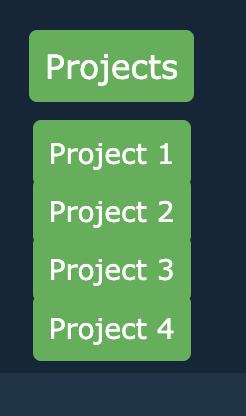

# Portfolio-Page

##Description

I have made a webpage to act as a portfolio for all the projects that I work on throughout the bootcamp. It is designed to introduce perspective employers to me and showcase the skills I have learnt, through applications that I have built. There is a section at the bottom that will let perspective employers contact me, as well as links to my GitHub account to view any projects that are not showcased on this page, and my Linked In account.

##Installation

No installation needed. The code is deployed as a stand alone page on Git Pages, (https://karra-ormsby.github.io/Portfolio-Page/)

##Usage

You can navigate through the page using the navigation bar at the top of the page that will take you to specific sections, or just scroll through the page as a whole. If you click/hover over projects navigation link you will see a dropdown menu that will take you to a specific project on the page.  

You can click on an image associated to a project and it will take you to the deployed application (as it is Week 3 of the bootcamp all images are placeholder images and they all link to the GitHub homepage). In the contacts section you can click the links fir GitHub and LinkedIn to take you to my pages. (at the moments these links just take you to these websites homepages).

##Credit

Used this youtube video (https://www.youtube.com/watch?v=gEbG3xyQoxA&t=307s) for clarification on how to set up a dropdown menu.

Reached out to AskBCS for assistance in resizing a stubborn image.

